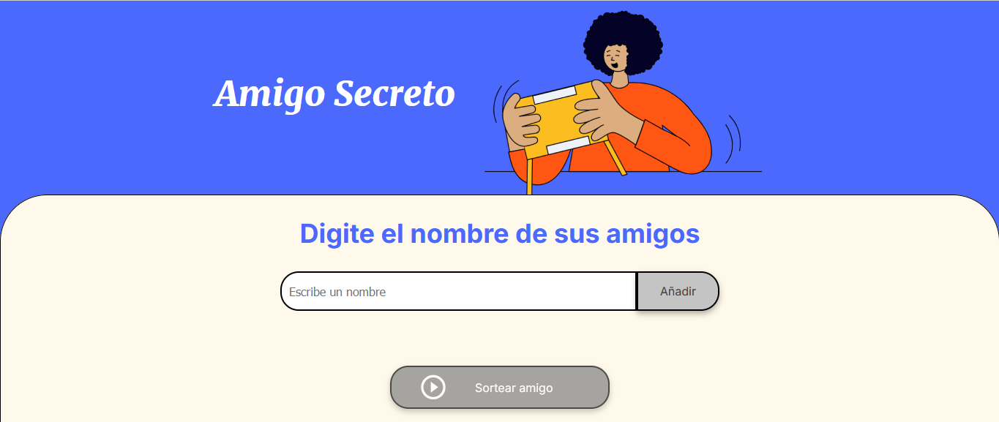
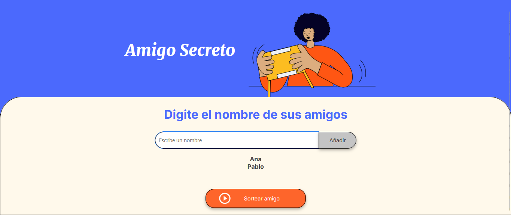

# Juego del Amigo Secreto



El siguiente juego del Amigo Secreto permite al jugador ingresar los nombres de sus amigos para después hacer un sorteo y mostrar que Amigo Secreto le tocó de manera aleatoria. 

---

## Descripción

- **Para jugar es necesario ingresar por lo menos 2 nombres de amigos** (*la lógica original del juego es que por lo menos se ingrese un nombre*)



- Puedes jugar ya sea clonando el repositorio de manera local e instalando la extensión **Live Server** en **Visual Studio Code** o mediante el **Deployment** de este mismo repositorio.

---

## Características 

- **Permite ingresar los nombres de tus amigos utilizando la tecla ENTER** (*de igual manera con el botón de **Añadir***)

- Muestra los nombres de tus amigos en la parte inferior conforme los añades

- Al presionar el botón de **Sortear amigo** se mostrará el resultado de tu **Amigo Secreto** obtenido de manera aleatoria.

## Requisitos (No necesarios si utilizas el Deployment de Github)

- **Visual Studio Code**
    - Extensión de **Live Server**

---

## Instalación de la extensión Live Server en VSCode

[Instalando Live Server en VSCode](https://github.com/user-attachments/assets/f19dcca3-632b-4c28-92d6-42b160124f26)

## Uso

[Jugando el Juego del Amigo Secreto](https://github.com/user-attachments/assets/b89022b5-9ea4-48d5-98c4-b0750d32d282)

1. **Coloca los nombres de tus amigos** ingresandolos con **Enter** o presionando el botón **Añadir**

2. **Una vez que hayas ingresado más de 2 nombres de tus amigos podrás sortear para ver tu Amigo Secreto**:

## Estructura del Proyecto

```
.
main
└─── assets
│    └─── amigo-secreto.png
│    └─── play_circle_outline.png
└─── readmeimgandvid
│    └─── amigo-secreto-fin-juego.png
│    └─── amigo-secreto-main-page.png
│    └─── amigo-secreto-nombres-minimo.png
│    └─── live-server-vscode.png
│   
└─── app.js
└─── index.html
└─── README.md
└─── style.css
```
- **assets**: Carpeta con las imagenes utilizadas en el Juego.
- **readmeimg**: Imágenes y videos utilizados en este README.md
- **app.js**: Backend scripting utilizando JavaScript.
- **index.html**: HTML del juego.
- **style.css**: Formato de estilo del juego
- **README.md**: Este archivo.

---

## Contribuciones

¡Las contribuciones son bienvenidas! Por favor, abre un issue o un pull request para cualquier mejora o corrección.

---
Si tienes alguna otra pregunta o necesitas más ayuda, ¡no dudes en decírmelo!
---
